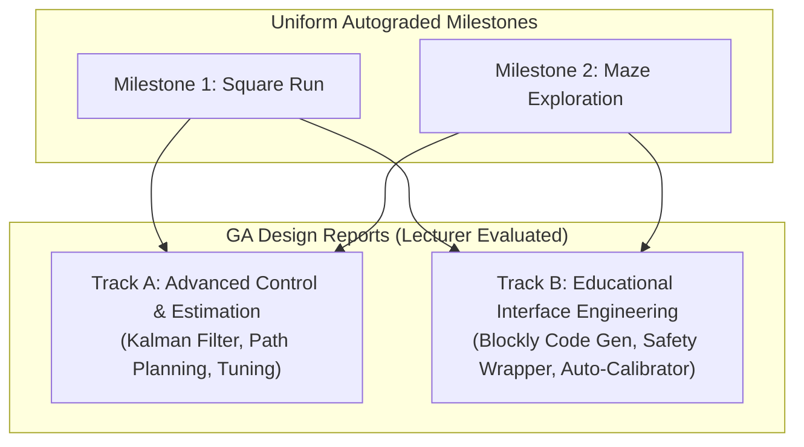

# 2026 EEE3097S/8S/9S Micromouse Course-Level Implementation Plan

This plan documents the structural modifications, redesigned milestones, and optional tracks for the 2026 academic year. It leverages the new high-resolution encoders, dual Python/Simulink co-simulation architecture, and multi-OS support to meet ECSA design graduate attributes more rigorously.

---

## 1. Curriculum Overview & 2026 Upgrades

| Feature | 2025 Baseline | 2026 Upgraded Framework |
| :--- | :--- | :--- |
| **Odometry / Feedback** | No wheel encoders (open-loop timing/imu estimation). | High-resolution wheel encoders (precise tick counts). |
| **Development OS** | Windows-only (Simulink desktop execution constraints). | Cross-platform (Mac, Linux, Windows co-simulation). |
| **Languages** | Simulink / Stateflow only. | Dual-path: **MicroPython/PikaScript** or **Simulink/Stateflow**. |
| **Motor Polarity** | Hardcoded by students per robot chassis. | Normalized at kernel level; dynamic configuration via `set_polarity()`. |

---

## 2. Redesigned Milestones (Uniform & Autograded)

To ensure grading remains scalable, objective, and deterministic, **all students complete the same uniform Milestone tasks**. The autograder will grade submissions against continuous scoring metrics rather than binary pass/fail limits.

### Milestone 1: Dead Reckoning & Closed-Loop Path Traversal
* **Task (The Square Run):**
  - The mouse must drive a closed loop: **Drive 1.0m straight, turn 90° right, repeat 4 times to form a 1.0m x 1.0m square, and stop.**
  - *Note on scale:* Reduced from 1.5m to 1.0m to fit within lab floor space constraints.
* **Continuous Grading Rubric:**
  - Grades are awarded proportionally based on the Euclidean error distance ($d_e$) from the starting point $(0,0)$:
    - **100%:** Excellent feedback control ($d_e \le 5 \text{ cm}$).
    - **75%:** Good tracking control ($5\text{ cm} < d_e \le 15\text{ cm}$).
    - **60%:** Baseline pass ($15\text{ cm} < d_e \le 30\text{ cm}$).
    - **Proportional reduction:** Grades drop off linearly for larger errors, but a student who moves and completes the run will not receive 0%.
* **Adversarial Testing (Autograder):** The autograder will test student models against parameter perturbations to verify that they are using active feedback (speed matching & gyro heading alignment) rather than raw timing or hardcoded open-loop delays. Perturbations will include:
    - Motor asymmetry (e.g. left wheel gain +5%, right wheel gain -3%).
    - **Wheel Slip / Traction Loss:** Simulating realistic wheel slippage (especially during acceleration/turns) to force students to fuse gyro heading data rather than relying purely on encoder counts.
    - *Note on Encoder Pulses:* To keep grading fair and prevent debugging bottlenecks, the simulation will **not** simulate missed encoder pulses (which can be difficult to filter without an Extended Kalman Filter), though students are encouraged to discuss hardware interrupt reliability in their reports.

### Milestone 2: Robust Maze Exploration
* **Task:** Autonomous exploration of a 4x6 grid maze to visit and map as many cells as possible and attempt to return to the starting cell.
* **Continuous Grading Rubric:**
  - Score is calculated proportionally: $\text{Score} = w_1 \cdot (\% \text{ cells visited}) + w_2 \cdot (\% \text{ walls mapped}) - \text{penalties}$.
  - **Wall Collision Handling:** Hitting a wall does **not** result in 0% for the assignment. Instead, it halts the simulation for that run, stops the timer, and awards points based on the cells successfully explored *before* the collision, minus a minor penalty (e.g. -10%).
  - **Bonus:** Extra marks are awarded for successfully planning a path back to the starting cell.

---

## 3. Split Graduate Attribute (GA) Project Tracks (Lecturer Assessed)

While the autograded milestone tasks are uniform, students choose between two distinct tracks for their **GA Design Project Reports** (which are evaluated manually by the lecturer).

### Track A: Advanced Control & Estimation (Traditional)
* **Focus:** Deep engineering analysis of physical systems, parameter estimation, and optimal control.
* **Report Content:**
  - System identification of the DC motor parameters and wheel slip.
  - Designing and tuning a Kalman filter to fuse gyro heading data with wheel encoders.
  - Implementing mapping algorithms (e.g., Floodfill, Wall-following PID) and shortest-path planning (e.g., A* or Dijkstra).

### Track B: Educational Interface Engineering (Optional New Track)
* **Focus:** Software systems engineering, usability, API safety constraints, and automated calibration.
* **Report Content:**
  - **Code-Gen Blockly Web-App Integration:** Designing a web application where users write drag-and-drop Blockly scripts. Rather than being tethered with a USB cable during runs, the Web App acts as a **code generator**, compiling blocks into standard `main.py` script code and deploying it over USB using `deploy.py`. The mouse is then run **untethered**.
  - **High-Level Safety Wrapper (`uct_blocks.py`):** Designing safe, child-friendly subroutines (e.g., `move_cells(n)`) that encapsulate encoder logic and override commands to halt if a ToF sensor detects an obstacle closer than 3 cm.
  - **Self-Test and Auto-Calibration Utility:** Writing an interactive script that guides non-expert users through checks (drag, polarity, display status) and saves the calibrated coefficients directly to `polarity.txt` on the mouse.
